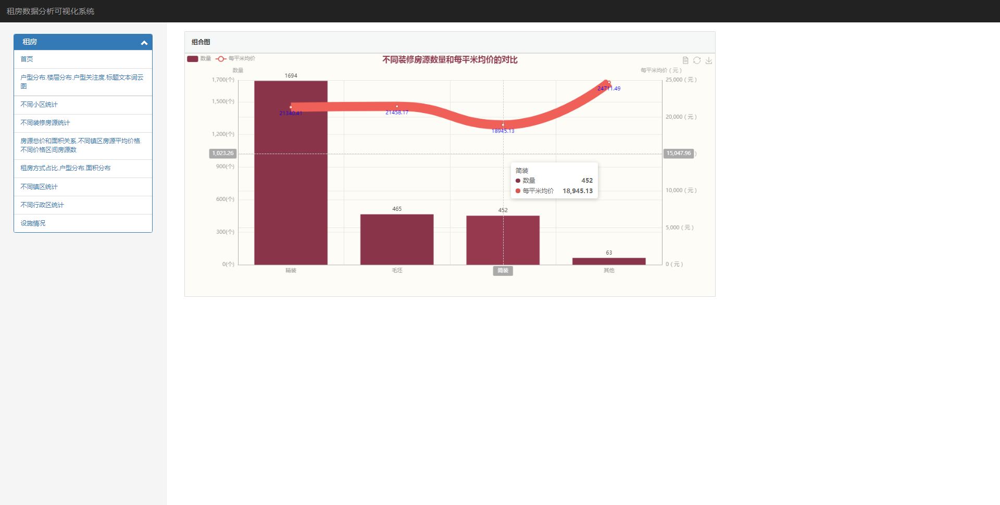

# 租房数据可视化

# 源码请添加微信或者 qq 联系获取

<html>
    

        <table align="center" >
            <tr>
                <td>
                    
                </td>
                <td>
                    
                </td>
            </tr>
        </table>
    

</html>

## Django+mysql+echart
***

## 主体
- 首页

## 数据分析
- 户型楼层等数据

## 价格信息

