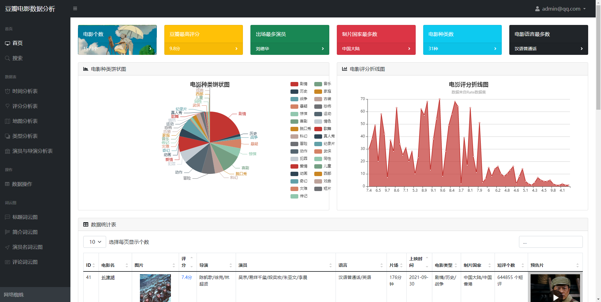
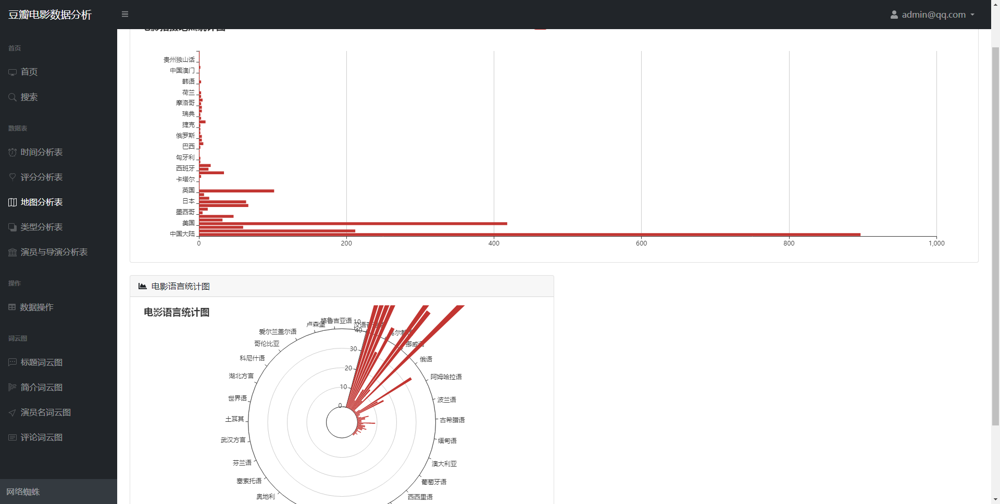
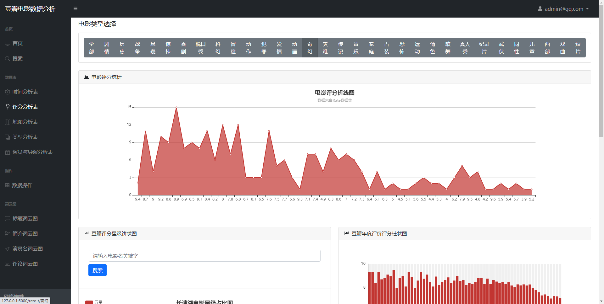
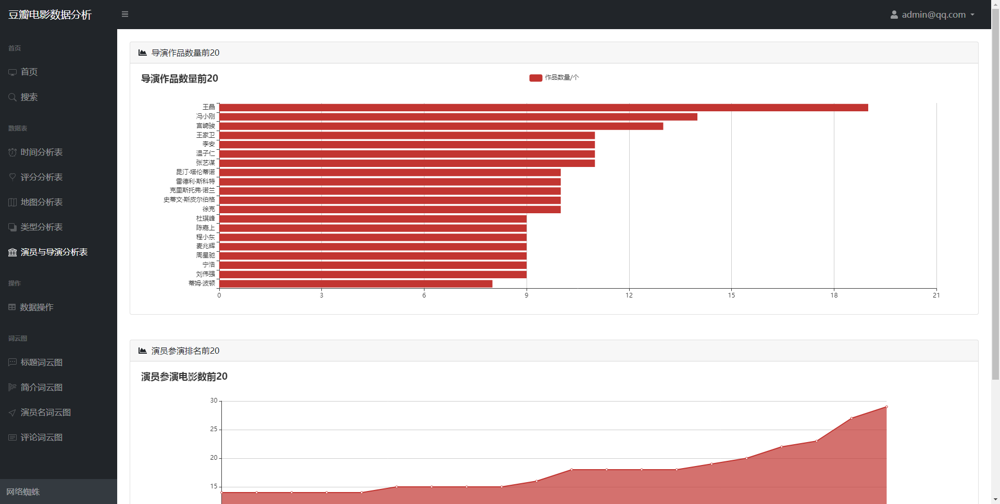
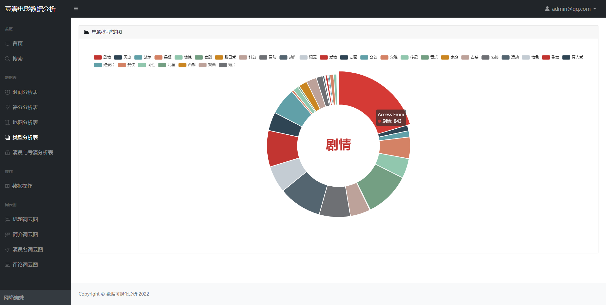
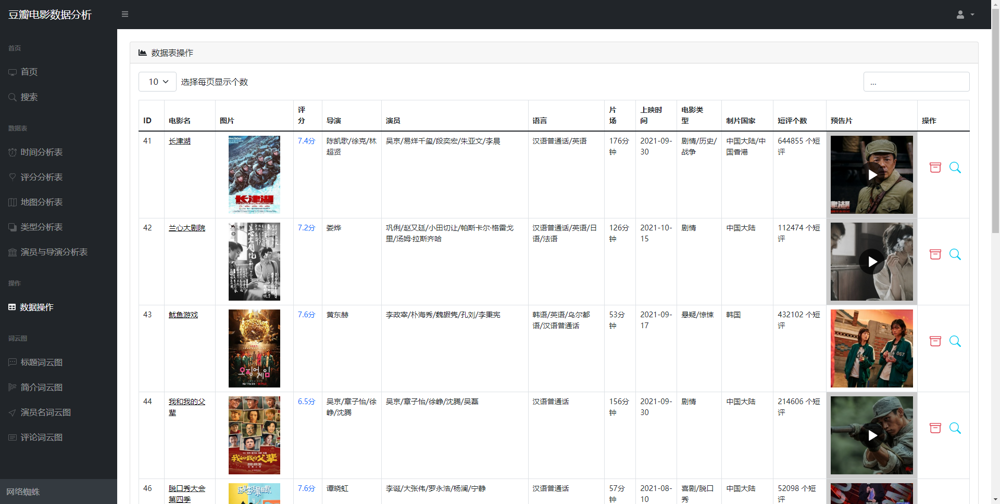
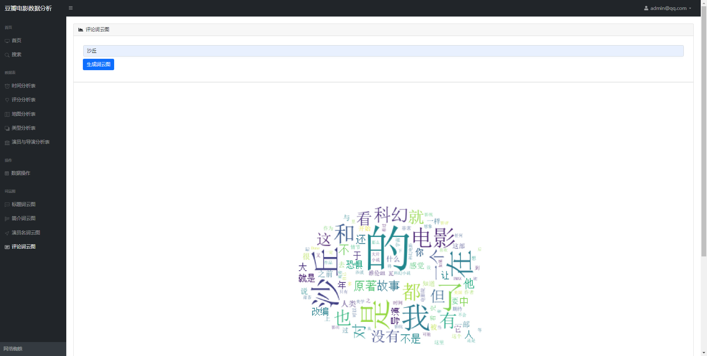
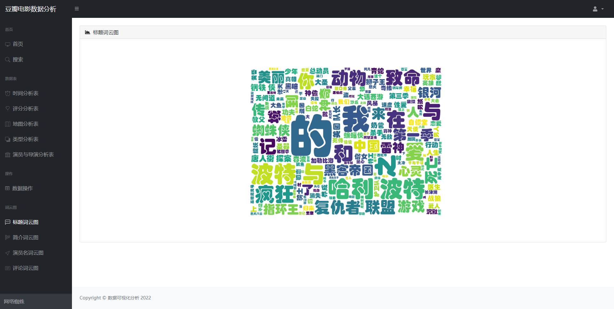
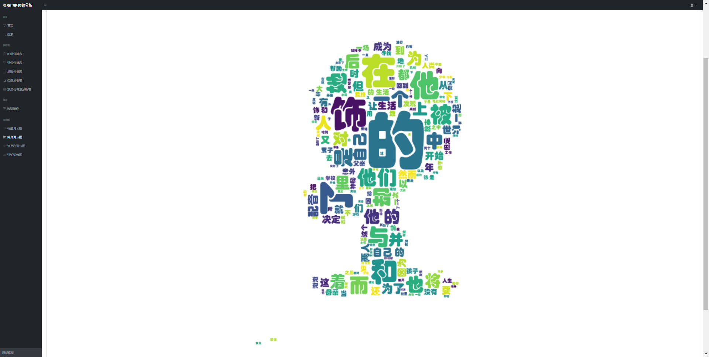

# 豆瓣电影数据可视化分析
<<<<<<< HEAD
# 源码请添加微信或者 qq 联系获取

<html>
    <table style="margin-left: auto; margin-right: auto;">
        <tr>
            <td>

            </td>
            <td>

            </td>
        </tr>
    </table>
</html>

## Django+mysql+echart+spider
=======
## Flask+mysql+echart+spider
>>>>>>> 629bcdc1b76a7111461acb8e1af0c44efcd033a4
***

## 主体
- 主页

- 搜索

## 数据分析
- 电影地区分析

- 评分分析

- 演员分析

- 电影类型分析

## 数据管理
- 查看电影的详细信息(分页查看/搜索查看)

- 选取电影评论生成词云

- 词云图片

